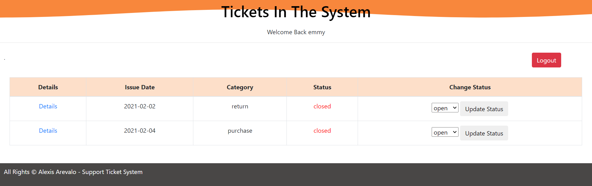
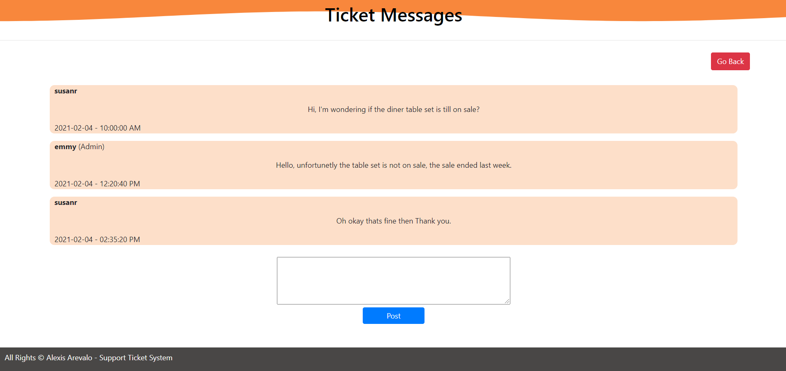

# HTTP5203 XML Project - Ticket System
### HTTP5203 - Individual Assignment
#### Description:

- I was required to create 2 XML files for a support ticket system:
    - one for users that login and one for tickets.
    - For each XML file, an XML Schema was created to define the structure for each file.

- Once those XML files were created and populated with mock data, I was required to use PHP to create a functional support ticket system application using the data from the XML files. This included:
    - A user can login to view his or her tickets (client) or view all tickets (admin).
    - A user can create support tickets by submitting an issue (an initial message).
    - both the client and the admin can submit messages to the ticket that both sides can see.
    - Tickets can be marked as closed by an admin.

## Tools:

- XML
- Schemaa

  

## Images:

#### Logins
Admin
- Username: emmy | Password: emmy

Client
- Username: danc | Password: danc

